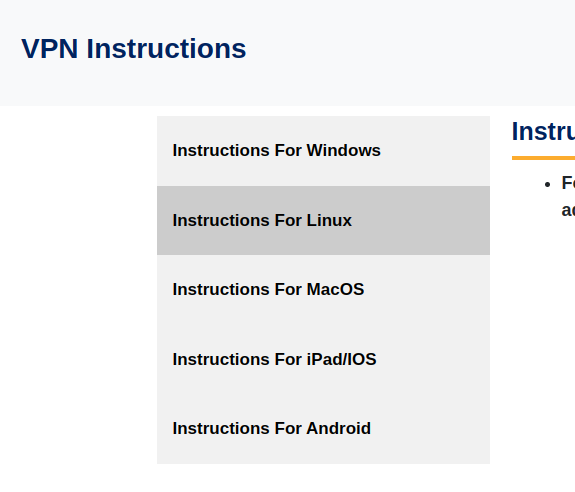

# VPN Guide for Manjaro(arch-based)

> - As of writing these instructions, I had kernel version "6.1.68-1-MANJARO".
> - Whenever you are asked for IIIT username and passwords during this procedure, you are to enter your LDAP credentials (the one you use to login at https://courses.iiit.ac.in/)

## Pre-requisites

Install openvpn on your system if you don't have it already. If I have some time to spare, I prefer to use

```bash
sudo yay -Syu openvpn
```

This installs openvpn along with any other updates pending. Otherwise, simply use

```bash
sudo yay -S openvpn
```

You can use other package managers too like pacman or pamac or flatpak.

## Step-by-Step procedure

1. Go to https://vpn.iiit.ac.in/
2. Go to "Instructions for Linux"

1. Download the configuration file "ubuntu.ovpn" by clicking here (you will be prompted to enter your username and password)
2. After downloading the file, go to "Settings --> Network --> VPN" and add a connection. When prompted for the type of VPN to add, select the last option titled "Import from file".
3. When prompted to choose a file, select the file that you just downloaded (ubuntu.ovpn).
4. After you select the file, the configuration details will be filled in automatically. You just need to enter your username(your email address) and your password.
5. Voila! You're good to go. Just toggle the switch as needed.
